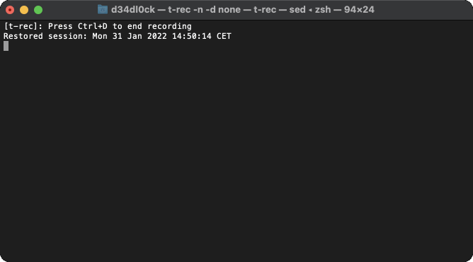

<div align="center">
 
 <h1><strong>Putzen</strong></h1>

[](https://www.gnu.org/licenses/gpl-3.0)
[](https://crates.io/crates/putzen-cli)
[](https://deps.rs/repo/github/sassman/putzen-rs)
[](https://github.com/sassman/putzen-rs/actions?query=branch%3Amain+workflow%3ABuild+)
[](https://tokei.rs/b1/github/sassman/putzen-rs?category=code)

"putzen" is German and means cleaning. It helps keeping your disk clean of build and dependency artifacts safely.



</div>

## About 

In short, putzen solves the problem of cleaning up build or dependency artifacts.
It does so by a simple "File" -> "Folder" rule. If the "File" and "Folder" is present, it cleans "Folder"

It also does all this fast, means in parallel (if the filesystem supports it).

### Supported Artifacts

putzen supports cleaning artifacts for:

| type       | file that is checked | folder that is cleaned |
|------------|----------------------|------------------------|
| rust       | Cargo.toml           | target                 |
| javascript | package.json         | node_modules           |
| CMake      | CMakeLists.txt       | build                  |

furthermore, it does also support:
- It can do run a dry-run (`-d`)
- Interactive asking for deletion
- Sums up the space that will be freed

## Quick Start

### Install

To install the `putzen`, you just need to run

```bash
cargo install putzen-cli
```

**Note** the binary is called `putzen` (without `-cli`)

to verify if the installation was successful, you can run `which putzen` that should output similar to

```sh
$HOME/.cargo/bin/putzen
```

### Usage

```sh
$ putzen --help

Usage: putzen <folder> [-v] [-d] [-y] [-L] [-a]

help keeping your disk clean of build and dependency artifacts

Positional Arguments:
  folder            path where to start with disk clean up.

Options:
  -v, --version     show the version number
  -d, --dry-run     dry-run will never delete anything, good for simulations
  -y, --yes-to-all  switch to say yes to all questions
  -L, --follow      follow symbolic links
  -a, --dive-into-hidden-folders
                    dive into hidden folders too, e.g. `.git`
  --help            display usage information
```

## Alternative Projects

- [kondo](https://github.com/tbillington/kondo)

## License

- **[GNU GPL v3 license](https://www.gnu.org/licenses/gpl-3.0)**
- Copyright 2019 - 2022 © [Sven Assmann][https://d34dl0ck.me]
- Logo - [Clean icons created by photo3idea_studio - Flaticon](https://www.flaticon.com/free-icons/clean)