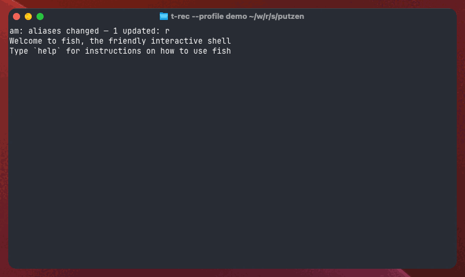

<div align="center">
 
 <h1><strong>Putzen</strong></h1>

[](https://www.gnu.org/licenses/gpl-3.0)
[](https://crates.io/crates/putzen-cli)
[](https://deps.rs/repo/github/sassman/putzen-rs)
[](https://github.com/sassman/putzen-rs/actions?query=branch%3Amain+workflow%3ABuild+)

"putzen" is German and means cleaning. It helps keeping your disk clean of build and dependency artifacts safely.



</div>

## About 

In short, putzen solves the problem of cleaning up build or dependency artifacts.
It does so by a simple "File" -> "Folder" rule. If the "File" and "Folder" is present, it cleans "Folder"

It also does all this fast, means in parallel (if the filesystem supports it).

### Supported Artifacts

putzen supports cleaning artifacts for:

| type       | file that is checked | folder that is cleaned |
|------------|----------------------|------------------------|
| rust       | Cargo.toml           | target                 |
| javascript | package.json         | node_modules           |
| CMake      | CMakeLists.txt       | build                  |

furthermore, it does also support:
- It can do run a dry-run (`-d`)
- Interactive asking for deletion
- Sums up the space that will be freed

## Quick Start

### Install

### On Linux as snap

[](https://snapcraft.io/putzen)

- installation [for Linux Mint](https://snapcraft.io/install/putzen/mint)
- installation [for Arch Linux](https://snapcraft.io/install/putzen/arch)

*TL;DR:*
```sh
sudo snap install putzen
```

### With cargo

To install the `putzen`, you just need to run

```sh
cargo install putzen-cli
```

**Note** the binary is called `putzen` (without `-cli`)

to verify if the installation was successful, you can run `which putzen` that should output similar to

```sh
$HOME/.cargo/bin/putzen
```

### Usage

```sh
$ putzen --help

Usage: putzen [-v] [--scores] [-d] [-y] [-L] [-a] [--no-hidden] [--include-hidden <include-hidden...>] [--] [<folder>]

help keeping your disk clean of build and dependency artifacts Hidden directories are normally skipped, except for `.worktrees/` (so colocated git worktrees are cleaned alongside the main checkout). Use `--include-hidden <GLOB>` to override the list, `--no-hidden` to turn it off entirely, or `-a` to descend into every hidden dir. Examples:     putzen                                       # descends into `.worktrees` by default     putzen --include-hidden '.{worktrees,jj}'   # one glob, two hidden dirs     putzen --include-hidden '.work*'             # any hidden dir starting with `.work`     putzen -a                                    # every hidden dir (== '*')     putzen --no-hidden                           # skip all hidden dirs (legacy)

Positional Arguments:
  folder            path where to start with disk clean up.

Options:
  -v, --version     show the version number
  --scores          show the stored highscore board and exit
  -d, --dry-run     dry-run will never delete anything, good for simulations
  -y, --yes-to-all  switch to say yes to all questions
  -L, --follow      follow symbolic links
  -a, --dive-into-hidden-folders
                    include every hidden directory (== --include-hidden '*')
  --no-hidden       skip every hidden directory (overrides the default
                    `.worktrees`)
  --include-hidden  glob of hidden directories to descend into (repeatable).
                    Match is against the full basename including the leading
                    dot, e.g. `.worktrees`, `.{worktrees,jj}`, `.work*`.
                    Default: `.worktrees`.
  --help, help      display usage information
```

### Hidden directories

`putzen` skips hidden directories by default, **except for `.worktrees/`** —
projects that colocate git worktrees inside the repo get cleaned in one run.

- `--include-hidden <GLOB>` — pick which hidden dirs to descend into (repeatable). Default: `.worktrees`. Glob is matched against the full basename including the leading dot, so write `.worktrees`, `.{worktrees,jj}`, `.work*`.
- `--no-hidden` — skip *all* hidden directories (pre-3.x behavior).
- `-a` / `--dive-into-hidden-folders` — descend into every hidden directory (equivalent to `--include-hidden '*'`).

These three are mutually exclusive.

### Highscores

Every putzen run earns you a little reward. The biggest single cleanup and the biggest total run ever measured are kept as a tiny gold/silver/bronze podium. Keep running it on your machine and watch your records stack up over time — show the board any time with `--scores`:

```
❯ putzen --scores

   ──── ★ SINGLE CLEANUP ★ ────
     🥇 Gold
         40.1GiB · 2026-03-14
   ────────────────────────────
     🥈 Silver
         37.9GiB · 2026-03-10
   ────────────────────────────
     🥉 Bronze
          6.5GiB · 2026-03-14
   ────────────────────────────

   ──── ★    TOTAL RUN   ★ ────
     🥇 Gold
         60.3GiB · 2026-03-14
   ────────────────────────────
     🥈 Silver
         44.6GiB · 2026-03-10
   ────────────────────────────
     🥉 Bronze
         19.6GiB · 2026-04-03
   ────────────────────────────
```

## Alternative Projects

- [kondo](https://github.com/tbillington/kondo)

## License

- **[GNU GPL v3 license](https://www.gnu.org/licenses/gpl-3.0)**
- Copyright 2019 - 2023 © [Sven Kanoldt](https://d34dl0ck.me)
- Logo - [Clean icons created by photo3idea_studio - Flaticon](https://www.flaticon.com/free-icons/clean)
